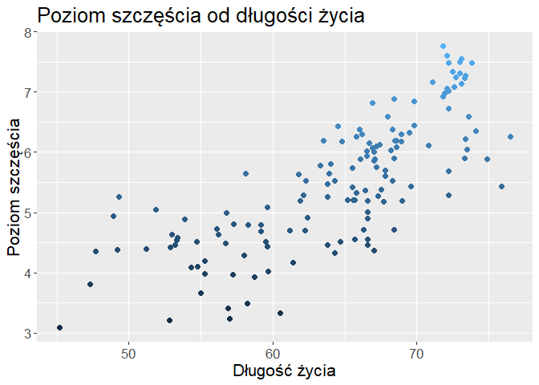
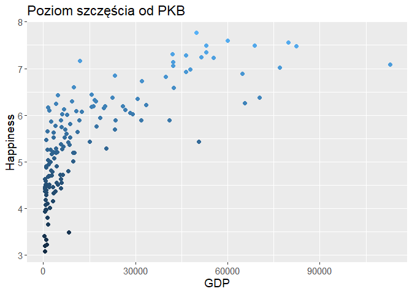
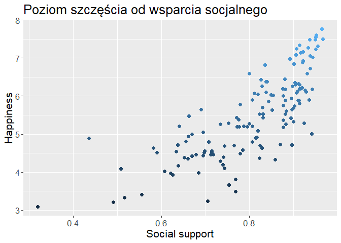
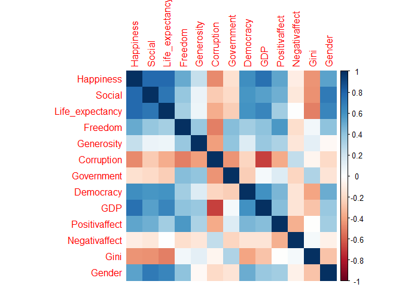
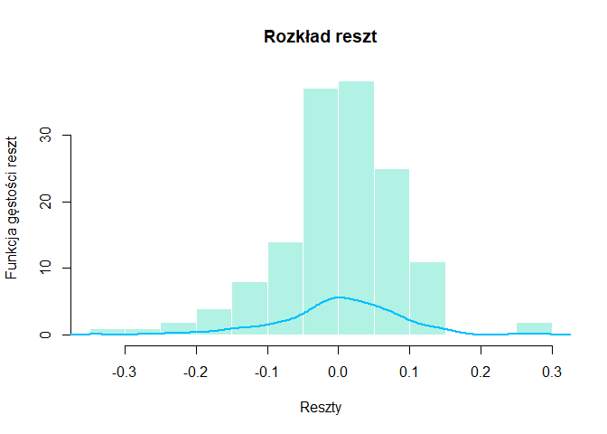

Analiza ekonometryczna poziomu szczęścia mieszkańców poszczególnych
krajów na podstawie World Happiness Report 2018
================
Joanna Koła
05.05.2019

Badanie poziomu życia ludności różnych części świata jest jednym z
najważniejszych problemów makroekonomicznych. W odpowiedzi na coraz
częstsze pytania, czy mierniki takie jak Produkt Krajowy Brutto czy HDI(
Human Development Index) wiernie oddają jakość życia ludności danego
kraju, od wielu lat ekonomiści poszukują nowych sposobów na
uporządkowanie państw świata względem poziomu życia w ich obrębie.
Jednym z takich sposobów jest badanie tzw. poziomu szczęścia. Jednym z
badań tego typu jest World Happiness Report. W ramach badania
przeprowadzane są ankiety z mieszkańcami różnych krajów, przedstawiające
pełen ranking najszczęśliwszych państw świata, rodząc wiele pytań.
Dlaczego akurat kraje skandynawskie od wielu lat zawsze plasują się na
samym szczycie rankingu? Czy wpływa na to wysoki krajowy produkt brutto,
mała nierówność społeczna, czy mieszkańcy tych krajów zwyczajnie
potrafią bardziej cieszyć się życiem? W poniższej pracy zostanie w miarę
możliwości i dostępnych danych ekonomicznych wytłumaczone jakie czynniki
kształtują w największym stopniu poziom szczęścia na świecie.

**Przygotowanie danych**

**Opis zbioru danych**

Zbiór użytych danych pochodzi z oficjalnej strony World Happiness
Report. Dane na temat poziomu szczęścia pochodzą z badania
przeprowadzonego w 2018 roku, natomiast pozostałe zmienne dla każdego
kraju z najnowszych dostępnych źródeł. Przy analizie pominięto kraje o
których nie ma pełnych danych. Jako możliwe do wykorzystania przy
modelowaniu zmienne przyjęte zostały:

-   ***GDP per capita*** mierzone parytetem siły nabywczej. Użyta
    została oficjalna prognoza OECD Economic.

-   ***Health Life Expectancy*** - przewidywany czas życia noworodka w
    zdrowiu, zgodnie z definicją zdrowia według Światowej organizacji
    zdrowia

-   ***Social Support*** - średnia odpowiedzi mieszkańców kraju na
    pytanie ,,Czy w przypadku problemów możesz zwrócić się dorodziny lub
    bliskich?” ( odpowiedź 0 lub 1)

-   ***Freedom to make life choices*** - średnia odpowiedzi mieszkańców
    poszczególnych krajów na pytanie ‘’ Czy jesteś usatysfakcjonowany z
    wolności podejmowania życiowych decyzji?” ( odpowiedź 0 lub 1)

-   ***Generosity*** - wartość parametru regresji średniej krajowej
    odpowiedzi na pytanie „ Czy przeznaczyłeś pieniądze na fundacje w
    ostatni miesiącu?” od GDP per capita

-   ***Government*** - średnia krajowa odpowiedzi (0 lub 1) na pytanie
    „Czy uważasz rząd w twoim kraju za godny zaufania?”

-   ***Perceptions of corruption*** - średnia krajowa odpowiedzi na
    pytania „ Czy według Ciebie korupcja jest powszechna wsród rządu?”
    oraz „ Czy według Ciebie korupcja jest powszechna w środowisku
    biznesowym?” ( odpowiedzi0 lub 1). W przypadku gdy brakuje
    odpowiedzi na pytanie pierwsze, brane pod uwagę jest drugie.

-   ***Democracy index*** - opracowany przez Economist Intelligence Unit
    opiera się na 60 wskaźnikach pogrupowanych w pięciu różnych
    kategoriach: proces wyborczy i pluralizm, swobody obywatelskie,
    funkcjonowanie administracji publicznej, partycypacja polityczna
    oraz kultura polityczna. Demokracje pełne to wartośc wskaźnika od 9
    do 10.

``` r
dane=read_excel("World Happiness Report 2018.xls")
names(dane)=c("Country","Happiness","Social","Life_expectancy","Freedom","Generosity","Corruption","Government","Democracy", "GDP", "Positivaffect","Negativaffect","Gini","Gender")
dane=na.omit(dane)
```

``` r
dane %>%
  arrange(desc(Happiness)) %>%
  mutate_each(funs(round(., 2)), -c(Country, Happiness)) %>%
  head(10)
```

    ## # A tibble: 10 x 14
    ##    Country     Happiness Social Life_expectancy Freedom Generosity Corruption
    ##    <chr>           <dbl>  <dbl>           <dbl>   <dbl>      <dbl>      <dbl>
    ##  1 Finland          7.77   0.96            71.8    0.96     -0.01        0.19
    ##  2 Denmark          7.6    0.95            72.1    0.96      0.15        0.18
    ##  3 Norway           7.55   0.95            73.1    0.95      0.22        0.25
    ##  4 Iceland          7.49   0.97            73      0.94      0.24        0.73
    ##  5 Netherlands      7.49   0.94            72.2    0.92      0.24        0.36
    ##  6 Switzerland      7.48   0.95            73.8    0.92      0.18        0.32
    ##  7 Sweden           7.34   0.91            72.5    0.93      0.16        0.24
    ##  8 New Zealand      7.31   0.95            73      0.94      0.290       0.22
    ##  9 Canada           7.28   0.93            73.4    0.95      0.16        0.36
    ## 10 Austria          7.25   0.91            72.7    0.89      0.13        0.52
    ## # ... with 7 more variables: Government <dbl>, Democracy <dbl>, GDP <dbl>,
    ## #   Positivaffect <dbl>, Negativaffect <dbl>, Gini <dbl>, Gender <dbl>

**Wizualizacja danych**

Aby zbadać które zmienne powinny znaleźć się w modelu warto przyjrzeć
się zależnościom między powyższymi zmiennymi, a poziomem szczęścia. W
tym celu warto spojrzeć na wykres korelacji między poszczególnymi
zmiennymi. Według niego najsilniejsza dodatnia korelacja z poziomem
szczęścia występuje w przypadku Life\_expectancy, GDP oraz Social
Support. Obrazują to również wykresy zależności między tymi zmiennymi:

``` r
ggplot(dane, aes(x = Life_expectancy, y = Happiness)) +geom_point(aes(colour =Happiness),
             size = 2) +guides(color = "none")+labs(x = "Długość życia",    y = "Poziom szczęścia", title="Poziom szczęścia od długości życia") + theme(text = element_text(size=16))
```

<!-- -->

``` r
ggplot(dane, 
       aes(x = GDP, 
           y = Happiness)) +
  
  geom_point(aes(colour = Happiness),
             size = 2) +
  labs(x = "GDP",
       y = "Happiness", title="Poziom szczęścia od PKB")+
  guides(color = "none")+
  theme(text = element_text(size=14))
```

<!-- -->

``` r
ggplot(dane, 
       aes(x = Social, 
           y = Happiness)) +
  geom_point(aes(colour = Happiness),
             size = 2) +
  labs(x = "Social support",
       y = "Happiness", title="Poziom szczęścia od wsparcia socjalnego")+
  guides(color = "none")+
  theme(text = element_text(size=16))
```

<!-- -->

Ponieważ w przypadku GDP przy niskich wartościach, zależność jest słabo
widoczna, wykonana zostanie w przypadku tej zmiennej transformacja
logarytmiczna.

``` r
ggplot(dane, 
       aes(x = log(GDP), 
           y = Happiness)) +
  geom_point(aes(colour = Happiness),
             size = 2) +
  labs(x = "log(GDP)",
       y = "Happiness",
       title="Wykres poziomu szczęścia od  logarytmu z PKB") +
  theme(text = element_text(size=12))
```

<!-- -->

Teraz zależność między zmiennymi zdaje się być bardziej zbliżona do
funkcji liniowej. Przykuwa to jednak uwagę do kolejnego problemu,
widocznego też przy pomocy wykresu korelacji, a mianowicie iż PKB jest
bardzo mocno skorelowane z Heathy Life Expectancy ( Wykres zależności
obu zmiennych odpoziomu szczęścia wygląda prawie identycznie). Podobnie
wysoka korelacja występuję dla Heathy Life Expectancy i Social Support.
Wszystko to jest konieczne do uwzględnienia w późniejszym modelu. Silne
ujemne korelacje z poziomem szczęścia występują z kolei dla korupcji
oraz współczynnika Giniego.

``` r
ggplot(data=dane,aes(x=Happiness,y=Gini)) + geom_point(col="darkblue")
```

<!-- -->

``` r
ggplot(data=dane,aes(x=Happiness,y=Corruption)) + geom_point(col="darkblue")
```

<!-- -->

***Obserwacja korelacji***

Najłatwiej zależności między zmiennymi zaobserwować za pomocą macierzy
korelacji:

``` r
Num.cols <- sapply(dane, is.numeric)
Cor.data=cor(dane[c("Happiness","Social","Life_expectancy","Freedom","Generosity","Corruption","Government","Democracy","GDP", "Positivaffect","Negativaffect","Gini","Gender")])
corrplot(Cor.data, method = 'color') 
```

<!-- -->

Podsumowując warto uzględnić wszystkie powyższe zmienne jednak nie
powinny się one znaleźć w jednym modelu ze względu na występujące między
nimi korelacje:

-   ***GDP oraz Life\_expectancy*** cor= 0,65
-   ***GDP oraz Corruption*** cor= -0,68
-   ***Life\_expectancy oraz Social*** cor=0,72

Jednocześnie mało skorelowane z poziomem szczęścia są Generosity oraz
Positive i Negative affection przez co uwzględnianie ich w modelu może
okazać się bezzasadne. Zostanie to jednak potwierdzone w dalszej
analizie.

***Konstrukcja modelu***

W związku z wysoką korealacją PKB z Healthy Life Expectancy na początku
stworzone zostaną dwa modele aby sprawdzić który lepiej objaśnia badane
zjawisko. Pominięto w oszacowaniach zmienną Negative affection jako
blisko związaną z Positive affection. Uwzględnione zostały jeszcze w
modelach Generosity oraz Positive affection, pomimo ich niewielkiej
korelacji z Happiness, aby móc zrewidować to testami statystycznymi.

W pierwszym modelu pominięto GDP oraz Social support, a skorzystano z
Healthy Life Expectancy:

``` r
model1= lm(Happiness~ Social+Government+Gini+Freedom+Positivaffect+Gender+Generosity+log(GDP),data=dane)
summary(model1)
```

    ## 
    ## Call:
    ## lm(formula = Happiness ~ Social + Government + Gini + Freedom + 
    ##     Positivaffect + Gender + Generosity + log(GDP), data = dane)
    ## 
    ## Residuals:
    ##      Min       1Q   Median       3Q      Max 
    ## -1.32902 -0.22547  0.02021  0.27570  1.28722 
    ## 
    ## Coefficients:
    ##               Estimate Std. Error t value Pr(>|t|)    
    ## (Intercept)    1.26009    0.62240   2.025 0.044899 *  
    ## Social         2.49578    0.59796   4.174 5.36e-05 ***
    ## Government    -0.89267    0.24649  -3.622 0.000414 ***
    ## Gini          -1.24157    0.42445  -2.925 0.004045 ** 
    ## Freedom        2.47542    0.47673   5.192 7.53e-07 ***
    ## Positivaffect  0.75019    0.49212   1.524 0.129767    
    ## Gender        -2.50783    0.82360  -3.045 0.002802 ** 
    ## Generosity     0.71357    0.30212   2.362 0.019622 *  
    ## log(GDP)       0.35797    0.04217   8.488 3.46e-14 ***
    ## ---
    ## Signif. codes:  0 '***' 0.001 '**' 0.01 '*' 0.05 '.' 0.1 ' ' 1
    ## 
    ## Residual standard error: 0.4586 on 134 degrees of freedom
    ## Multiple R-squared:  0.8303, Adjusted R-squared:  0.8201 
    ## F-statistic: 81.94 on 8 and 134 DF,  p-value: < 2.2e-16

W modelu drugim z kolei pominięto zmienne Life Expectancy oraz
Corruption, a uwzględniono GDP:

``` r
model2 = lm(Happiness~Government+Gini+Positivaffect+Freedom+Positivaffect+Life_expectancy+Gender+Generosity+ Corruption, data=dane)
summary(model2)
```

    ## 
    ## Call:
    ## lm(formula = Happiness ~ Government + Gini + Positivaffect + 
    ##     Freedom + Positivaffect + Life_expectancy + Gender + Generosity + 
    ##     Corruption, data = dane)
    ## 
    ## Residuals:
    ##     Min      1Q  Median      3Q     Max 
    ## -1.7516 -0.2864  0.0697  0.3752  0.9469 
    ## 
    ## Coefficients:
    ##                 Estimate Std. Error t value Pr(>|t|)    
    ## (Intercept)      2.24616    0.97852   2.295   0.0233 *  
    ## Government      -1.71185    0.30545  -5.604 1.14e-07 ***
    ## Gini            -2.16104    0.48629  -4.444 1.83e-05 ***
    ## Positivaffect    1.66378    0.52776   3.153   0.0020 ** 
    ## Freedom          2.58973    0.53868   4.808 4.04e-06 ***
    ## Life_expectancy  0.05258    0.01108   4.745 5.27e-06 ***
    ## Gender          -0.41160    0.87710  -0.469   0.6396    
    ## Generosity       0.68966    0.34378   2.006   0.0469 *  
    ## Corruption      -1.49010    0.32473  -4.589 1.01e-05 ***
    ## ---
    ## Signif. codes:  0 '***' 0.001 '**' 0.01 '*' 0.05 '.' 0.1 ' ' 1
    ## 
    ## Residual standard error: 0.5176 on 134 degrees of freedom
    ## Multiple R-squared:  0.7838, Adjusted R-squared:  0.7709 
    ## F-statistic: 60.74 on 8 and 134 DF,  p-value: < 2.2e-16

***Porównanie modeli***

``` r
cat("Kryterium Akkaike'a dla modelu z Healthy Life Expectancy:", AIC(model1))
```

    ## Kryterium Akkaike'a dla modelu z Healthy Life Expectancy: 193.581

``` r
cat("Kryterium Akkaike'a dla modelu z GDP:", AIC(model2))
```

    ## Kryterium Akkaike'a dla modelu z GDP: 228.1646

Mając już dwa konkurencyjne modele porównano ich kryterium Akkaike
wynoszące dla modelu z GDP - 193.53, a dla modelu z Healthy Life
Expectancy - 228.16. Lepszy jakościowo okazał się, więc model z PKB jako
zmienną objaśniającą.

***Weryfikacja modelu***

``` r
reset(model1)
```

    ## 
    ##  RESET test
    ## 
    ## data:  model1
    ## RESET = 4.0735, df1 = 2, df2 = 132, p-value = 0.0192

Mając już wybrany model, można przyjrzeć się otrzymanym oszacowaniom. W
przypadku oszacowania dla zmiennej Positive affection nie możemy
odrzucić hipotezy o jego nieistotności, nawet przy empirycznym poziomie
istotności 0,1. Również wynik testu reset (p-value = 0.0192) wskazuje na
nieprawidłową specyfikacje modelu. Zmienna ta wysoce prawdopodobnie nie
jest istotna dla dalszej analizy. Jednak po jej usunięciu test reset
nadal wskazuje na nieprawidłową specyfikację modelu (nadal p-value =
0,0192) zamieniona zostanie więc zmienna objaśniana modelu na logarytm z
Happiness. Teraz p-value w teście reset wynosi 0,63 i przy poziomie
istotności równym 0,05 nie ma postawy do odrzucenia hipotezy zerowej
mówiącej o poprawnej postaci funkcyjnej modelu i rzeczywiście przy
zmiennych logarytmicznych zależność zbiega znacznie bardziej do funkcji
linowej:

``` r
model3=lm(log(Happiness)~ Social+Government+Gini+Freedom+Gender+Generosity+log(GDP),data=dane)
reset(model3)
```

    ## 
    ##  RESET test
    ## 
    ## data:  model3
    ## RESET = 0.45113, df1 = 2, df2 = 133, p-value = 0.6379

``` r
ggplot(data=dane,aes(x=log(Happiness),y=log(GDP))) + geom_point(col="darkblue")
```

-1.png)<!-- -->
W tak uzyskanym modelu istnieje podstawa do odrzucenia hipotez zerowych
o nieistotności oszacowania w przypadku każdej zmiennej objaśniającej
poza Generosity dlatego zmienna ta zostanie usunięta.

***Diagnostyka modelu regresji***

Aby wykorzystanie naszego modelu do analiz statystycznych było
uzasadnione muszą zostać spełnione założenia metody najmniejszych
kwadratów.

**Normalność składnika losowego**

Jako pierwsze sprawdzone zostanie założenie o normalności składnika
losowego.

``` r
model = lm(log(Happiness)~ Social+Government+Gini+Freedom+Gender+log(GDP),data=dane)
reszty=model$residuals
hist(reszty, border=F , col=rgb(0.4,0.9,0.8,0.5) , main="Rozkład reszt" ,  xlab="Reszty", ylab="Funkcja gęstości reszt")
lines(density(reszty), col="deepskyblue", lwd=2)
```

<!-- -->

``` r
shapiro.test(reszty)
```

    ## 
    ##  Shapiro-Wilk normality test
    ## 
    ## data:  reszty
    ## W = 0.96392, p-value = 0.0008113

Wykres wydaje się być zbliżony do rozkładu normalnego. Aby jednak
jeszcze to potwierdzić wykonany został test Shapiro-Wilka. Test ten (
p-value= 0,0008) przy przyjętym poziomie istotności daje podstawy do
odrzucenia hipotezy zerowej o rozkładzie normalnym reszt. Przy dużych
próbach niespełnienie założenia o normalności nie dyskwalifikuje jednak
wyników testów istotności.

**Sferyczność macierzy wariancji-kowariancji**

Kolejnym ważnym etapem analizy ekonometrycznej modelu jest sprawdzenie
założenia o sferyczności macierzy wariancji-kowariancji. Ponieważ moje
dane są przekrojowe w moim modelu niesferyczność macierzy
wariancji-kowariancji może wynikać z heteroskedastyczności.

``` r
ehat2=(model$residuals)^2
gqResult = gqtest(model) 
bpResult = bptest(model)
print(gqResult)
```

    ## 
    ##  Goldfeld-Quandt test
    ## 
    ## data:  model
    ## GQ = 0.97752, df1 = 65, df2 = 64, p-value = 0.5365
    ## alternative hypothesis: variance increases from segment 1 to 2

``` r
print(bpResult)
```

    ## 
    ##  studentized Breusch-Pagan test
    ## 
    ## data:  model
    ## BP = 14.625, df = 6, p-value = 0.02338

Na podstawie testu Goldfelda-Quandta z którego otrzymaliśmy wartość
p-value=0.5365 przy poziomie istotności 0,05 nie ma podstaw do
odrzucenia hipotezy zerowej o homoskedastyczności składnika losowego.
Ponieważ jednak wariancja błędu losowego modelu może zależeć od kilku
zmiennych warto zrobić jeszcze test Breuscha-Pagana. Wartość tego
testu(p-value=0.023) również daje nam podstawy do odrzucenia hipotezy
zerowej o homoskedastyczności składnika losowego. Istnieje więc
podejrzenie heteroskedastyczności składnika losowego w modelu. Wariancja
błędu losowego może nie być stała dla wszystkich obserwacji, a tym samym
macierz wariancji-kowariancji może nie być sferyczna, a estymatory być
nieefektywnym. Skoro testy statystyczne wskazują na heteroskedastycznośc
warto się zastanowić która zmienna(bądź zmienne) ją powodują.

``` r
ggplot(data.frame(ehat2,dane$Gender), aes(y=ehat2, x=dane$Gender, color=ehat2)) + geom_point() + xlab("Gender")+ ylab("Kwadraty Reszt") +guides(color = "none")+ geom_smooth(aes(color =ehat2), method = "lm", fullrange = TRUE)
```

    ## `geom_smooth()` using formula 'y ~ x'

<!-- -->

``` r
ggplot(data.frame(ehat2,dane$Social), aes(y=ehat2, x=dane$Social, color=ehat2)) + geom_point() + xlab("Social")+ ylab("Kwadraty Reszt") +guides(color = "none")+ geom_smooth(aes(color =ehat2), 
                                                                                                                                                                                       method = "lm", fullrange = TRUE) 
```

    ## `geom_smooth()` using formula 'y ~ x'

<!-- -->

``` r
ggplot(data.frame(ehat2,log(dane$GDP)), aes(y=ehat2, x=log(dane$GDP), color=ehat2)) + geom_point() + xlab("log(GDP)")+ ylab("Kwadraty Reszt") +guides(color = "none")+ geom_smooth(aes(color =ehat2), 
                                                                                                                                                                                       method = "lm", fullrange = TRUE) 
```

    ## `geom_smooth()` using formula 'y ~ x'

<!-- -->

``` r
ggplot(data.frame(ehat2,dane$Freedom), aes(y=ehat2, x=dane$Freedom, color=ehat2)) + geom_point() + xlab("Freedom")+ ylab("Kwadraty Reszt") +guides(color = "none")+ geom_smooth(aes(color =ehat2), 
                                                                                                                                                                                       method = "lm", fullrange = TRUE) 
```

    ## `geom_smooth()` using formula 'y ~ x'

<!-- -->

``` r
ggplot(data.frame(ehat2,dane$Gini), aes(y=ehat2, x=dane$Gini, color=ehat2)) + geom_point() + xlab("Gini")+ ylab("Kwadraty Reszt") +guides(color = "none")+ geom_smooth(aes(color =ehat2), 
                                                                                                                                                                                       method = "lm", fullrange = TRUE) 
```

    ## `geom_smooth()` using formula 'y ~ x'

<!-- -->

``` r
ggplot(data.frame(ehat2,dane$Government), aes(y=ehat2, x=dane$Government, color=ehat2)) + geom_point() + xlab("Government")+ ylab("Kwadraty Reszt") +guides(color = "none")+ geom_smooth(aes(color =ehat2),method = "lm", fullrange = TRUE) 
```

    ## `geom_smooth()` using formula 'y ~ x'

<!-- -->

Wszystkie zmienne poza Freedom wykazują zależność między kwadratami
reszt a wartością zmiennej objaśnianej. Mamy więc kilka zmiennych
objaśniających podejrzewanych o heteroskedastyczność. Zastosowany
zostanie odporny estymator macierzy wariancji-kowariancji. Użyty
zostanie w tym celu estymator HC3. Po jego zastosowaniu otrzymane
oszacowania i ich istotność nie zmieniają się, wyniki testów
statystycznych nie powinny być jednak już obciążone.

***Interpretacja końcowego modelu***

``` r
summary(model)
```

    ## 
    ## Call:
    ## lm(formula = log(Happiness) ~ Social + Government + Gini + Freedom + 
    ##     Gender + log(GDP), data = dane)
    ## 
    ## Residuals:
    ##      Min       1Q   Median       3Q      Max 
    ## -0.34125 -0.04018  0.00568  0.05233  0.28441 
    ## 
    ## Coefficients:
    ##              Estimate Std. Error t value Pr(>|t|)    
    ## (Intercept)  0.892581   0.122759   7.271 2.54e-11 ***
    ## Social       0.633360   0.114212   5.545 1.47e-07 ***
    ## Government  -0.155105   0.047601  -3.258 0.001415 ** 
    ## Gini        -0.204723   0.083680  -2.447 0.015701 *  
    ## Freedom      0.522546   0.087567   5.967 1.98e-08 ***
    ## Gender      -0.545736   0.160140  -3.408 0.000862 ***
    ## log(GDP)     0.063360   0.008354   7.584 4.73e-12 ***
    ## ---
    ## Signif. codes:  0 '***' 0.001 '**' 0.01 '*' 0.05 '.' 0.1 ' ' 1
    ## 
    ## Residual standard error: 0.09192 on 136 degrees of freedom
    ## Multiple R-squared:  0.8062, Adjusted R-squared:  0.7977 
    ## F-statistic: 94.31 on 6 and 136 DF,  p-value: < 2.2e-16

Przy poziomie istotności 0,05 w przypadku wszystkich zmiennych
objaśniających można odrzucić hipotezę zerową o braku istotności
statystycznej całego oszacowania. Wybrane czynniki łącznie wyjaśniają
około 80% zmienności poziomu szczęścia. Z oszacowań wynika, iż zgodnie z
intuicją ekonomiczną przy wzroście PKB poziom szczęścia w danym kraju
rośnie.

-   W przypadku wzrostu **PKB**(transformacja logatytmiczna) o 100 %
    poziom szczęścia(transformacja logarytmiczna) zwieksza się o 6,3 %.

-   w przypadku ***wsparcia socjalnego*** dla wzrostu o 0,1 zmienna
    objaśniana rośnie o 6,3%

-   w przypadku ***poczucia wolności*** wzrost zmiennej o 0,1 powoduje
    wzrost poziomu szczęścia o 5,2%

-   przy wzroście ***nierówności społecznej*** mierzonej współczynnikiem
    Giniego 0,1, poziom szczęścia spada o 2%

-   im mniejsza wartość ***indeksu równości płci*** oznaczająca mniejszą
    nierówność tym niższy poziom szczęścia. Spadek indeksu o 0,1 wiąże
    się z jego spadkiem o 5,4%.

-   zaskakujące może być oszacowanie w przypadku zmiennej Government.
    Wskazuje ono, iż w przypadku wzrostu ***zaufania do rządu*** o 0,1
    poziom szczęścia spada o 1,5%. Wynika prawdopodobnie ze złego
    sposobu pomiaru, bądź może wskazywać na to, iż zmienna ta nie
    powinna być uwzględniona w modelu.
